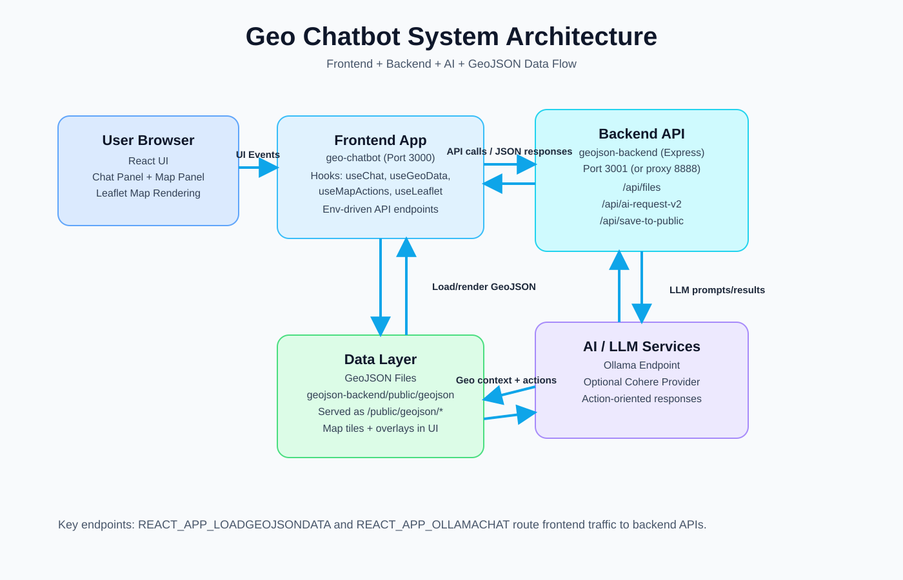

# Geo Chatbot

Geo Chatbot is a map-based web application that combines a React + Leaflet frontend with an Express backend to analyze and interact with GeoJSON data using AI-assisted chat actions.

## System Architecture



## Project Structure

- `src/`: React frontend (chat UI, map panels, hooks, map actions)
- `geojson-backend/`: Express backend for GeoJSON APIs and AI requests
- `public/`: frontend static assets
- `geojson-backend/public/geojson/`: stored and served GeoJSON files

## Prerequisites

- Node.js 18+ (recommended)
- npm
- Optional: local Ollama server (if AI endpoint depends on Ollama)

## Environment Variables

Create `.env` in the root project:

```env
REACT_APP_LOADGEOJSONDATA=http://localhost:8888/api/files
REACT_APP_OLLAMACHAT=http://localhost:8888/api/ai-request-v2
```

Create `geojson-backend/.env` (based on `.env.example`) for backend-specific settings:

```env
OLLAMA_ENDPOINT=http://localhost:11434
PORT=3001
```

## Install Dependencies

Install root/frontend dependencies:

```bash
npm install
```

Install backend dependencies:

```bash
cd geojson-backend
npm install
```

## Run the Application

Run backend:

```bash
cd geojson-backend
npm start
```

Run frontend in another terminal:

```bash
npm start
```

Frontend default URL: `http://localhost:3000`

## Key Backend Endpoints

- `GET /api/health`: service status check
- `GET /api/files`: list and validate GeoJSON files
- `POST /api/save-to-public`: upload/save GeoJSON files
- `POST /api/ai-request-v2`: AI chat/action processing

## Available Scripts (Root)

- `npm start`: run frontend in development mode
- `npm run build`: create production build
- `npm test`: run tests

## Available Scripts (Backend)

Inside `geojson-backend/`:

- `npm start`: run Express backend
- `npm run dev`: run backend with nodemon
